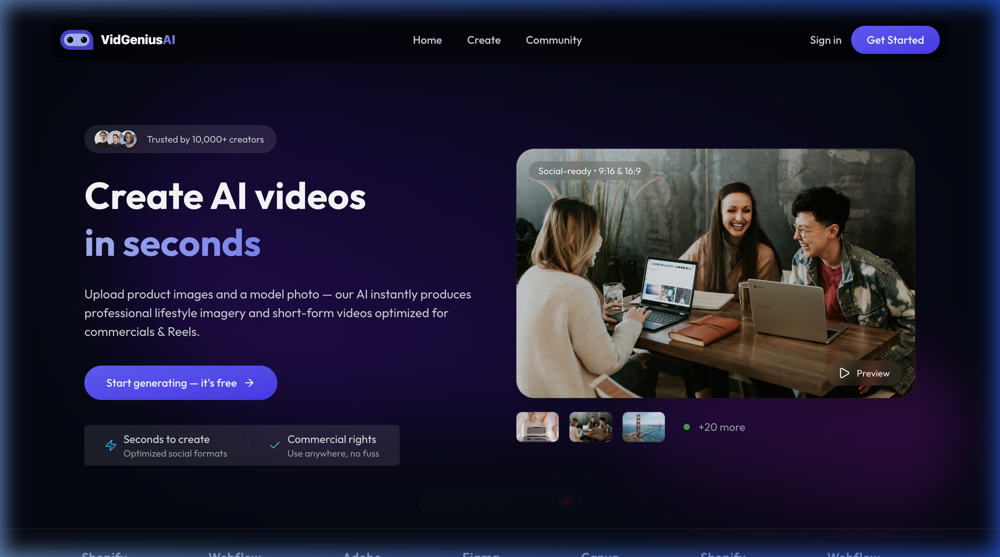
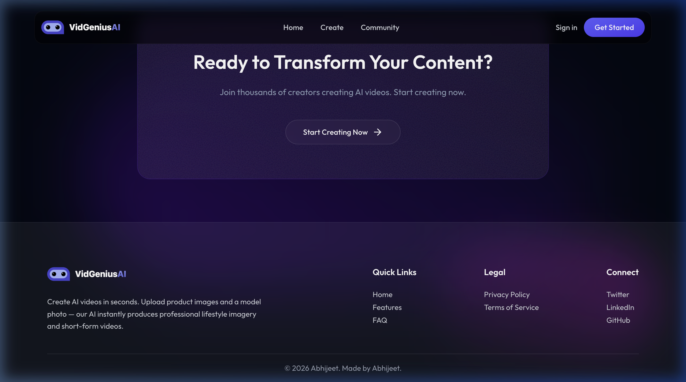

# VidGenius AI 🎥🤖

VidGenius AI is a full-stack, state-of-the-art AI Video Generation platform designed to transform text prompts and product images into professional-grade short-form video content. Built using a modern, premium dark-mode aesthetic with fluid micro-animations, this project serves as a showcase for advanced front-end design, secure backend routing, and mock integration sandbox flows.

---

## 🌟 Key Features

*   **Sleek Dark Mode UI:** High-fidelity user experience built using curated gradients, glassmorphic card layouts, custom page scroll behaviors, and responsive components.
*   **AI Video Generator Sandbox:** Includes a 3-second simulation delay for video rendering, dynamically serving high-quality local assets (`demo_video.mp4` & `product7.png`) to bypass API quotas/rate limits during presentations.
*   **Intuitive Video Tooltips:** Interactive, right-aligned tooltips on the generator dashboard to communicate free-tier limits clearly to users without screen cutoff.
*   **Clerk Authentication & Webhooks:** Integrated user identity management using Clerk components, protected client-side routes, and secure webhook event syncing.
*   **Comprehensive Knowledge Base:** A self-contained learning module under `/knowledge_base` containing architectural summaries, database schema models, and interview study guides.

---

## 📸 Screenshots

### Homepage Banner


### Call To Action & Footer Section


---

## 🛠️ Technology Stack

| Layer | Technologies |
| :--- | :--- |
| **Frontend** | React 19, Vite, TypeScript, Tailwind CSS, Framer Motion, Lenis Scroll, React Router |
| **Backend** | Node.js, Express, TypeScript, Multer, Prisma ORM, PostgreSQL |
| **Authentication** | Clerk Auth Suite & Webhooks |
| **Media Hosting** | Cloudinary Integration |

---

## ⚙️ Project Structure

```text
videogenius-ai/
├── client/              # React frontend (Vite configuration)
│   ├── public/          # Static assets
│   ├── src/
│   │   ├── assets/      # Media, icons, and mock video assets
│   │   ├── components/  # Nav, Footer, CTA, FAQ, Scroll utilities
│   │   ├── pages/       # Home, Generator, Community, Result pages
│   │   └── configs/     # Axios API configurations
│   └── package.json     # Client scripts & dependencies (gh-pages pre-configured)
├── server/              # Node/Express backend
│   ├── controllers/     # Route logic, Prisma transactions, Webhook handlers
│   ├── routes/          # Express routing (User, Project)
│   ├── prisma/          # DB schema models & database migrations
│   └── server.ts        # Main server entry point
├── screenshots/         # Website screenshots for GitHub/README
└── knowledge_base/      # Interview study guides and setup architecture docs
```

---

## 🚀 Local Development Setup

### 1. Prerequisites
Ensure you have **Node.js** and **npm** installed on your machine.

### 2. Backend Setup
1. Navigate to the server folder:
   ```bash
   cd server
   ```
2. Install dependencies:
   ```bash
   npm install
   ```
3. Set up your environment variables by creating a `.env` file:
   ```env
   PORT=5000
   DATABASE_URL="your-postgresql-database-url"
   CLERK_PUBLISHABLE_KEY="your-clerk-publishable-key"
   CLERK_SECRET_KEY="your-clerk-secret-key"
   CLERK_WEBHOOK_SECRET="your-clerk-webhook-signing-secret"
   CLOUDINARY_CLOUD_NAME="your-cloudinary-name"
   CLOUDINARY_API_KEY="your-cloudinary-key"
   CLOUDINARY_API_SECRET="your-cloudinary-secret"
   ```
4. Run Prisma database migrations:
   ```bash
   npx prisma migrate dev
   ```
5. Start the server:
   ```bash
   npm run server
   ```

### 3. Frontend Setup
1. Navigate to the client folder:
   ```bash
   cd ../client
   ```
2. Install dependencies:
   ```bash
   npm install
   ```
3. Create a `.env.local` file:
   ```env
   VITE_CLERK_PUBLISHABLE_KEY="your-clerk-publishable-key"
   VITE_BASEURL="http://localhost:5000"
   ```
4. Start the Vite dev server:
   ```bash
   npm run dev
   ```

---

## 📄 License & Attribution
*   **Author:** Abhijeet
*   **Copyright:** © 2026 Abhijeet. All rights reserved.
